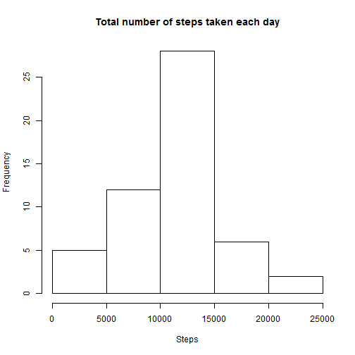

### Loading and preprocessing the data

The code loads the data and gives a class and a name to the columns.

```r
setwd("C:/Users/dimitri/datasciencecoursera/RepData_PeerAssessment1")
unzip("activity.zip")
data <- read.csv("activity.csv", header = TRUE, colClasses = c("numeric", "Date","numeric"))
head(data)
```

```
##   steps       date interval
## 1    NA 2012-10-01        0
## 2    NA 2012-10-01        5
## 3    NA 2012-10-01       10
## 4    NA 2012-10-01       15
## 5    NA 2012-10-01       20
## 6    NA 2012-10-01       25
```

### What is mean total number of steps taken per day?


```r
##Construction of a database without missing values.
y <- complete.cases(data)
data2 <- data[y,]
## Calculation of the average number of steps taken per day.
x <- lapply((split(data2$steps,data2$date)),sum)
```
**Histogram of the total number of steps taken each day.**

```r
x <- as.numeric(x)
hist(x, main = "Total number of steps taken each day", xlab = "Steps" )
```

 

**Calculation of the mean total number of steps taken each day.**

```r
mean(x)
```

```
## [1] 10766
```

**Calculation of the median total number of steps taken each day.**

```r
median(x)
```

```
## [1] 10765
```

### What is the average daily activity pattern?


```r
## Construction of the vector with every 5 minutes interval in a day.
x <- data$interval[1:288]
## Calculation of the average number of steps taken in a 5 minutes interval, averaged across all days.
y <- lapply((split(data2$steps,data2$interval)),mean)
y <- as.numeric(y)
```

**Time series plot of the 5-minute interval (x-axis) and the average number of steps taken, averaged across all days (y-axis).**

```r
plot(x,y, type = "l", main = "Average daily activity", xlab ="Hours (500 means 05:00)" , ylab = "Average steps taken in 5 min")
```

 

**8:35 is the 5-minute interval when on average across all the days in the dataset, contains the maximum number of steps (206.2).**

```r
names(y) <- x
y[y==max(y)]
```

```
##   835 
## 206.2
```

### Imputing missing values

**Calculation of the  total number of missing values in the dataset.**

```r
sum(is.na(data))
```

```
## [1] 2304
```
Where are the missing values?

```r
sapply((lapply((split(data$steps,data$date)),is.na)),sum)
```

```
## 2012-10-01 2012-10-02 2012-10-03 2012-10-04 2012-10-05 2012-10-06 
##        288          0          0          0          0          0 
## 2012-10-07 2012-10-08 2012-10-09 2012-10-10 2012-10-11 2012-10-12 
##          0        288          0          0          0          0 
## 2012-10-13 2012-10-14 2012-10-15 2012-10-16 2012-10-17 2012-10-18 
##          0          0          0          0          0          0 
## 2012-10-19 2012-10-20 2012-10-21 2012-10-22 2012-10-23 2012-10-24 
##          0          0          0          0          0          0 
## 2012-10-25 2012-10-26 2012-10-27 2012-10-28 2012-10-29 2012-10-30 
##          0          0          0          0          0          0 
## 2012-10-31 2012-11-01 2012-11-02 2012-11-03 2012-11-04 2012-11-05 
##          0        288          0          0        288          0 
## 2012-11-06 2012-11-07 2012-11-08 2012-11-09 2012-11-10 2012-11-11 
##          0          0          0        288        288          0 
## 2012-11-12 2012-11-13 2012-11-14 2012-11-15 2012-11-16 2012-11-17 
##          0          0        288          0          0          0 
## 2012-11-18 2012-11-19 2012-11-20 2012-11-21 2012-11-22 2012-11-23 
##          0          0          0          0          0          0 
## 2012-11-24 2012-11-25 2012-11-26 2012-11-27 2012-11-28 2012-11-29 
##          0          0          0          0          0          0 
## 2012-11-30 
##        288
```

There are missing value in only 8 days, and every values of these days are missing.
The following code chunk replaces the missing values of these 8 days by the mean for the corresponding 5-minute interval.

```r
X <- rep (y, 61)
##Creation of new dataset that is equal to the original dataset but with the missing data filled in.
for (i in 1:17568) {if (is.na(data[i,1]) == TRUE) {data[i,1] <- X[i]}}
```

**Histogram of the total number of steps taken each day.**

```r
## Calculation of the average number of steps taken per day.
z <- lapply((split(data$steps,data$date)),sum)
z <- as.numeric(z)
hist(z, main = "Total number of steps taken each day", xlab = "Steps")
```

 

**Calculation of the mean total number of steps taken each day.**

```r
mean(z)
```

```
## [1] 10766
```

**Calculation of the median total number of steps taken each day.**

```r
median(z)
```

```
## [1] 10766
```
**The mean is the same compared to the mean when we ignored the missing values. However the median is slightly higher.The impact of imputing missing datas is that there are 8 more days which have a number of steps corresponding to the mean.**

### Are there differences in activity patterns between weekdays and weekends?

```r
## Creation of a new factor variable in the dataset with two levels - "weekday" and "weekend"
day <- weekdays(data$date)
for (i in 1:17568) {if ((day[i] == "Sunday")|(day[i] == "Saturday")) {day[i] <- "weekend"} else {day[i] <- "weekday"}}
data <- cbind(data,day)
## Calculation of the average number of steps taken in a 5 minutes interval, averaged across all weekday days.
g <- lapply((split(data[data$day == "weekday",1],data[data$day == "weekday",3])),mean)
## Calculation of the average number of steps taken in a 5 minutes interval, averaged across all weekend days.
h <- lapply((split(data[data$day == "weekend",1],data[data$day == "weekend",3])),mean)
```

**Panel plot containing a time series plot of the 5-minute interval (x-axis) and the average number of steps taken, averaged across all weekday days or weekend days (y-axis).**

```r
par(mfrow = c(2,1))
plot(x,g,type = "l", main = "weekday",xlab ="Hours (500 means 05:00)" , ylab = "Average steps taken in 5 min",ylim = c(0,220), cex.axis = 0.6,cex.lab = 0.8)
plot(x,h,type = "l", main = "weekend",xlab ="Hours (500 means 05:00)" , ylab = "Average steps taken in 5 min",ylim = c(0,220), cex.axis = 0.6, cex.lab = 0.8)
```

 

